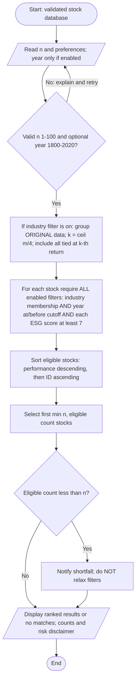

**Vrije Universiteit Amsterdam**  
**Computational Thinking**

# Project Assignment: iTrade

**Group number:** [Enter group number]

**Members with student numbers:**

- [Member 1] — [Student number 1]
- [Member 2] — [Student number 2]
- [Member 3] — [Student number 3]
- [Member 4] — [Student number 4]
- [Member 5] — [Student number 5]

**Task distribution:** [Record the actual research, algorithm design, implementation, testing and report contributions. Remove unused member rows.]

**Date:** 5 October 2026  
**Version:** v1

**Draft status:** Technical v1 using the supplied 500-stock dataset. Names, student numbers, actual group contributions and personal experience must be confirmed by the authors before submission. The supplied template's section order is followed; verification evidence and the complete Python application are included as appendices.

**Assistance acknowledgement:** An AI coding assistant helped revise the program and report, check references, run tests and generate the document exports. The submitting authors must review the work and adapt this acknowledgement to the course policy.

**Submission filename:** Confirm the required filename in Canvas. The template gives two alternatives:

- Cover instruction: `CT_REPORT_GROUPNUMBER`
- Final checklist: `CT_PROJECT_GROUPNUMBER`

<!-- pagebreak -->

## Context Task

Modern computing has made financial participation faster and more accessible, but accessibility should not be confused with informed decision-making. Kirilenko and Lo (2013) identify lower transaction costs and faster execution as benefits of algorithmic trading, while also examining threats to financial stability. In my view, these benefits justify continued innovation only when accountability develops alongside technical capability. A system that executes efficiently can still expose inexperienced users to risks they do not understand.

Automated recommendations illustrate this tension. Ranking investments reduces the effort required to compare alternatives, yet a precise numerical ordering can imply more certainty than the evidence warrants. A historical-return ranking, such as iTrade's, describes observations rather than guaranteeing future gains. I therefore consider transparent assumptions, explicit limitations, and user control essential design responsibilities, rather than optional interface features.

Social responsibility also cannot be reduced to an apparently objective score. Berg, Kölbel, and Rigobon (2022) document substantial disagreement among ESG rating providers, arising from differences in measurement, scope, and weighting. Consequently, an ESG filter should communicate its chosen threshold and acknowledge uncertainty instead of presenting selected companies as unambiguously ethical.

The consequences of financial computing also extend beyond platform users. Howson and de Vries (2022) argue that proof-of-work cryptocurrency production can disproportionately burden vulnerable communities through environmental and social impacts. Their analysis challenges the assumption that digital finance is socially beneficial merely because it offers new participation opportunities.

Overall, I support financial technologies that improve access while making uncertainty visible. Appropriate safeguards include understandable explanations, auditable selection rules, and regulation sensitive to costs imposed on non-users. Technical convenience is valuable, but it should not substitute for financial literacy or public accountability.

<!-- pagebreak -->

## Design process

### Requirements and scope

The supplied `app/stocks.csv` contains 500 stocks and is used for the examples and verification in this report. The report structure and VU logo were taken from the supplied `report_template.docx`, which is preserved unchanged. A separate marking rubric was not supplied; coverage is therefore checked against the assignment text and template. The dataset does not establish a return observation period or real-market provenance, so its values are treated as educational input rather than verified market observations.

The system recommends up to a user-specified number n, where `1 <= n <= 100`. It ranks stocks by the supplied performance percentage after applying any combination of three optional filters: industry leadership, establishment year and ESG criteria. All eight combinations of enabled/disabled filters are supported.

Each stock has a unique three-letter ID, performance, industry, foundation year and three ESG ratings from 1 to 10. Performance is interpreted as percentage points: `11.7` and `11.7%` both mean an 11.7% historical return, not a fractional value of 0.117. The algorithm assumes that performances use a comparable measurement period across all stocks; this is necessary for a meaningful ranking but cannot be verified from the supplied schema.

This is a screening tool, not a trading agent. It does not purchase stocks, allocate money, fetch live prices, predict returns or construct a diversified portfolio.

### Turning ambiguous preferences into explicit rules

**Industry leadership:** For an industry containing m stocks in the original database, calculate `k = ceil(m / 4)`. Sort that industry's performance values in descending order and take the k-th value as its cutoff. Every stock whose performance is at least this cutoff qualifies. Thus, the filter selects the top 25%, rounded up, with all ties at the boundary included. A one-company industry always has one qualifying company. A five-company industry uses its second-highest performance as the cutoff.

A fixed proportion is easier to explain than an industry-average rule and is less sensitive to a single exceptionally high return. Rounding up avoids excluding every company in a small industry. Including boundary ties avoids arbitrary exclusion of equal performers. More than 25% can qualify when values tie, and an industry in which every return is equal retains every stock. This is intentional.

**Original-database baseline:** Compute industry cutoffs before applying establishment or ESG filters. Otherwise, removing an industry's strongest companies could promote a relatively weak company into the leading group. The original-data approach makes industry eligibility stable regardless of the other preferences. Industry labels are grouped case-insensitively, with surrounding and repeated whitespace normalised; spelling differences are not inferred to be equivalent.

**Establishment year:** When enabled, ask for an integer cutoff between 1800 and 2020, inclusive, and keep stocks with `foundation_year <= cutoff`. This includes companies established in the selected year. The limit applies to user input, not the dataset: a company founded before 1800 can still qualify. Age is only a proxy for establishment, not evidence of safety or quality.

**ESG:** Require `environment >= 7 AND social >= 7 AND governance >= 7`. Requiring a minimum in each category prevents an excellent environmental rating from concealing a poor governance rating. The threshold is a transparent project design choice, not a scientifically established definition of responsible business. Ratings may be decimal values within the allowed 1–10 range. No category receives a special weight.

The interface exposes the three required preferences but keeps the industry fraction and ESG threshold fixed. This reduces novice users' configuration burden and keeps the algorithm reproducible.

### Combining preferences, ranking and handling shortages

Enabled filters are combined with **AND**. A disabled filter imposes no restriction. Eligible stocks are sorted by their original, unrounded performance in descending order. Equal returns are ordered alphabetically by the normalised stock ID, producing repeatable results. Decimal arithmetic avoids introducing binary floating-point differences when reading CSV values. Printed returns use two decimal places; display rounding never determines the ranking.

Select the first `min(n, eligible_count)` stocks. Boundary ties in the industry filter do not expand the requested final list: the ID tiebreaker resolves any tie at the final n-th position.

If fewer than n stocks qualify, show all qualifying stocks, report requested/eligible/shown counts, and explicitly state that no filters were relaxed. If none qualify, show a no-matches message and invite the user to change their preferences and run again. Automatically weakening ESG or establishment preferences would contradict the user's stated requirements.

Negative-return stocks remain eligible. The assignment asks for the highest returns, not exclusively positive returns; the strongest company in a poorly performing industry may still have a negative return. The program adds a caution if any displayed stock has a negative return. There is no industry quota in the final list, so industry leadership must not be mistaken for diversification.

### Inputs, validation and implementation structure

The program always asks for preferences interactively through `get_preferences()`. It asks for n and each yes/no preference, and requests a year only when the establishment preference is enabled. Invalid responses are explained and re-prompted. There are no command-line options or separate noninteractive mode. End-of-input or Ctrl+C cancels cleanly.

The CSV reader recognises the supplied headers (`ID`, `Performance`, `Industry`, `FoundationYear`, `Environment`, `Social`, `Governance`), the assignment's longer property names, and common equivalents such as `Ticker`, `Return`, `Sector`, `Founded`, `E`, `S` and `G`. It supports UTF-8 with an optional byte-order mark, and comma, semicolon or tab delimiters. Performance numbers must use a decimal point rather than a locale-specific decimal comma.

The entire dataset is validated before screening. Missing columns, duplicate or ambiguous headers, duplicate IDs, malformed row lengths, invalid years, missing industries, non-finite performance and out-of-range ESG values cause an error rather than silently removing companies. IDs are normalised to uppercase and must consist of three ASCII letters. Dataset foundation years must be integers from 1 to 9999. Additional columns are ignored. Blank lines are permitted.

The expected assignment dataset has 500 stocks. Rather than refusing smaller teaching/test datasets, the program accepts any nonempty valid dataset and displays a notice when its size differs from 500. Missing files cause an explicit error; the application never substitutes invented data.

`app/main.py` contains only the iTrade application: input handling, validation, filtering, ranking and presentation. It uses only the Python standard library. The supplied dataset is stored beside it in `app/stocks.csv`; this default path is resolved relative to the script rather than the caller's working directory. Tests are separate in `tests/test_app.py`. Report generation is separate document tooling in `scripts/build_report.py` and is never imported or invoked by the application. The app has no PDF, Word or LaTeX functionality or dependencies.

### Readable pipeline and function-based strategies

The application follows four explicit steps: load stocks, get preferences, recommend stocks and print the result. `Preferences` keeps the user's settings together in one immutable dataclass, a record whose fields have names. `Recommendation` similarly keeps the selected stocks and total eligible count together. Printing receives this result instead of repeating the selection process.

Each preference has a small checking function that returns true or false for one stock. `build_filters` selects only the enabled checks; `passes_all_filters` calls them in a plain loop. If any check fails, the stock is excluded. If no checks are enabled, every stock passes. This is a function-based strategy approach without abstract classes or inheritance. Local functions remember the original industry's leader IDs or the selected cutoff year. The code explains that functions are stored first and called later.

Pattern matching across eight combinations would duplicate rules, so three independent if statements select the checks instead. Explicit loops, descriptive names and `ceil(industry_size / 4)` favour readability over compact expressions. These implementation choices do not change the selection rules shown in the flowchart and pseudocode.

### Correctness and efficiency

Every returned stock comes from the eligible set, so it satisfies every enabled preference. The sorting key guarantees that no lower-return eligible stock precedes a higher-return one. Taking a prefix preserves that order and limits the list to n. As industry membership is calculated once on the full dataset, the order in which the remaining filter checks are evaluated does not change the outcome.

For N stocks, industry sorting and final ranking require at most **O(N log N)** time. Grouping and filtering are linear. Auxiliary storage is **O(N)**. This is comfortably sufficient for 500 records, and a straightforward sorting solution is easier to inspect than a more specialised optimisation.

### Alternatives, limitations and possible improvements

Alternatives considered include keeping only each industry's single strongest company, using above-average returns, or using a weighted ESG average. The first is overly restrictive, the second is sensitive to extreme returns, and the third allows compensation between ESG dimensions. The selected rules prioritise transparency over personalisation.

A production system would need verified data provenance and timestamps, comparable return periods, a treatment of volatility and liquidity, transaction costs and controls against misleading recommendations. It should also explain uncertainty in ESG measurements, consistent with Berg et al. (2022). These improvements are outside the supplied schema. Neither passing an ESG threshold nor appearing near the top of the output establishes suitability for a particular investor.

### Group work division and coordination

No group membership, contribution log or time record was supplied. Individual contributions therefore cannot honestly be attributed in this v1. Before submission, complete the following with the group's actual experience:

- **Members and responsibilities:** [Who researched sources, specified rules, implemented code, prepared the flowchart and edited the report?]
- **Integration and review:** [How did members compare the implementation, flowchart and pseudocode? Which tests did they review?]
- **Reflection on division:** [What worked, what was uneven or difficult, and what would the group change? If individual work, state that instead.]

The work can be divided into research, rule specification, implementation/testing and document integration. However, allocating these independently can create inconsistent definitions of industry leadership or ESG eligibility. A shared decision record and joint review of the same example output are therefore recommended. This is a proposed coordination strategy, not a claim about meetings or work that the group has already performed. AI assistance is disclosed on the cover and must be reviewed against course policy.

<!-- pagebreak -->

## Flowchart

The flowchart starts with a validated database; CSV parsing is a programming-specific prerequisite. The batch filtering step checks every stock once against all enabled preferences. The input retry loop represents the app's interactive preference entry.



The PDF uses a vector TikZ rendering of this process. The Word report embeds an image rendered from the identical TikZ chart; the Mermaid source above remains editable in Markdown.

<!-- pagebreak -->

## Pseudocode

```text
INPUT: validated stock database S

REPEAT
    READ integer n and three Boolean preference switches
    IF establishment preference is enabled THEN
        READ integer year_cutoff
    END IF
    valid <- n is an integer in [1, 100]
             AND (establishment is disabled
                  OR year_cutoff is an integer in [1800, 2020])
    IF NOT valid THEN explain the invalid input
UNTIL valid

leaders <- empty set
IF industry preference is enabled THEN
    GROUP all stocks in ORIGINAL S by normalised industry
    FOR EACH industry group Q DO
        m <- number of stocks in Q
        k <- CEILING(m / 4)
        SORT Q by performance descending
        cutoff <- performance of Q[k]  // positions start at 1
        FOR EACH stock s in Q DO
            IF s.performance >= cutoff THEN
                ADD s.ID to leaders
            END IF
        END FOR
    END FOR
END IF

eligible <- empty list
FOR EACH stock s in S DO
    industry_ok <- industry is disabled OR s.ID is in leaders
    year_ok <- establishment is disabled OR s.year <= year_cutoff
    esg_ok <- ESG is disabled OR
              (s.E >= 7 AND s.S >= 7 AND s.G >= 7)
    IF industry_ok AND year_ok AND esg_ok THEN
        APPEND s to eligible
    END IF
END FOR

SORT eligible by performance descending, then ID ascending
available <- LENGTH(eligible)
results <- FIRST MIN(n, available) elements of eligible

IF available < n THEN
    DISPLAY available, "stocks match; no filters were relaxed"
END IF
IF results is empty THEN
    DISPLAY "No matches; change preferences explicitly and run again"
ELSE
    DISPLAY numbered results: ID, return, industry, year, E, S, G
    IF any displayed return is negative THEN
        DISPLAY caution about negative historical returns
    END IF
END IF
DISPLAY data source, active filters, requested/eligible/shown counts
DISPLAY "Educational only; historical returns do not predict future gains"
END
```

Logical OR expressions short-circuit: a disabled establishment filter does not inspect an undefined cutoff. The implementation uses `None` for that disabled cutoff. Boolean switches must be valid yes/no responses; invalid responses are re-prompted in the interactive interface.

<!-- pagebreak -->

## Reflection

The main design lesson is that a precise implementation begins with explicit decisions about ambiguous requirements. Defining “highest in the industry” required decisions about rounding, ties and the comparison population. The original-database baseline prevents an unintended change in eligibility when other preferences are enabled. Keeping the flowchart, pseudocode and implementation consistent also makes assumptions easier to inspect.

Testing boundary conditions is as important as checking a typical recommendation. In particular, zero matches, exact ESG thresholds and tied returns reveal whether the algorithm respects its stated rules. A useful improvement to the assignment would be to specify the return measurement period and provide examples of expected boundary behaviour while retaining freedom over the filtering strategy.

**Author completion required:** Add your genuine reaction to the assignment, actual time spent and personal learning experience, keeping the final reflection within 200 words. These experiences cannot be inferred from the code or attributed to group members in this v1.

## Checklist for submission

- [ ] Complete names, student numbers, group details and actual contributions.
- [ ] Finalise the genuine personal reflection (maximum 200 words).
- [x] Context Task is 200–300 words with three cited academic references.
- [x] Flowchart, pseudocode and code specify the same filters, ties and shortfall policy.
- [x] Program tested with the supplied 500-stock dataset; actual results are in Appendix B.
- [x] Complete Python application included in Appendix C and `app/main.py`.
- [ ] Review assistance acknowledgement, course policy and the Canvas rubric.
- [ ] Submit the reviewed PDF with the filename confirmed in Canvas.

<!-- pagebreak -->

## Appendix A. Files and running instructions

The project contains:

```text
app/
    main.py                 iTrade application only
    stocks.csv              supplied dataset, unchanged
report.md                   editable report source
report.tex                  generated LaTeX report
report.pdf                  generated PDF report (v1)
report.docx                 generated editable Word report (v1)
report_template.docx        original supplied template, unchanged
scripts/build_report.py     separate document-generation tooling
tests/test_app.py           separate automated tests
```

Run from the project root using Python 3.10 or newer. No extra packages are required for the app or tests. Verification used Python 3.12 via `uv run --python 3.12`.

```bash
# Start the app and answer the prompts:
python3 app/main.py

# Or, from inside the app folder:
# python3 main.py

# Tests are separate from the app:
python3 -m unittest discover -s tests -v
```

The app always reads `stocks.csv` beside `main.py`, even when launched from a different directory. It asks how many stocks to show, whether to apply the industry filter, whether to apply the establishment filter (and its year if enabled), and whether to apply the ESG filter. Answer n to all three filter questions for an unfiltered ranking. The app prints recommendations and never creates report files.

Report exports are generated independently from the application:

```bash
nix shell nixpkgs#uv nixpkgs#pandoc nixpkgs#tectonic nixpkgs#poppler-utils \
  --command uv run --python 3.12 scripts/build_report.py

# Alternatively, rebuild only the PDF from the existing LaTeX:
nix shell nixpkgs#tectonic --command tectonic report.tex
```

Pandoc converts the Markdown; Tectonic typesets the PDF and vector flowchart; Poppler renders the flowchart image for Word. Word uses the supplied template as a style reference. The first build may download TeX packages. A standalone TeX rebuild needs `vu-logo.png` beside `report.tex`.

The build overwrites `report.tex`, `report.pdf` and `report.docx`, so keep `report.md` as the master source or preserve direct export edits separately. The Python appendix is inserted directly from `app/main.py` during export. Example results in the prose must be updated manually if the data or rules change. None of these build tools is needed to run iTrade.

<!-- pagebreak -->

## Appendix B. Verification and actual example output

### Test strategy

Executed with Python 3.12 using `uv run --python 3.12 -m unittest discover -s tests -v`:

```text
Ran 28 tests
OK
```

Tests cover all eight filter combinations, descending ranking and alphabetical ID ties, industry rounding and boundary ties, singleton industries, the original-database baseline, inclusive year and ESG thresholds, invalid preference bounds, shortages and zero results, n truncation, preservation of input data, invalid CSV values and row lengths, duplicate IDs and headers, missing headers, empty datasets, UTF-8 BOM and semicolon-delimited aliases, industry normalisation and interactive retry behaviour.

A key regression case places a strong newer company and a weaker older company in the same industry. Applying an old foundation cutoff must not promote the weaker company into the industry's top group. Other cases retain a negative-return singleton industry, demonstrating that industry leadership is relative rather than an assurance of profit.

Integration checks load the supplied dataset and compare all eight preference combinations with an independent oracle: a stock is an industry leader when fewer than `ceil(m/4)` industry peers have strictly higher returns. This rank-count formulation verifies the implementation's sorted-cutoff approach without calling that implementation to determine expected membership. Additional checks exercise interactive runs, execution from a different working directory, retries and missing-file handling. Strategy tests check that disabled filters impose no restrictions, separate filter lists retain their own settings, and printing does not recompute recommendations. Tests verify screening rules, not future investment outcomes.

### Dataset and filter coverage

The supplied dataset has 500 unique IDs across seven industries: agriculture (85), clothing (65), construction (75), electronics (71), energy (74), entertainment (67) and mining (63). All rows pass validation. Eligible counts before limiting results to n are:

| Industry filter | Founded by 1950 | ESG filter | Eligible |
|---|---|---|---:|
| Off | Off | Off | 500 |
| Off | Off | On | 35 |
| Off | On | Off | 340 |
| Off | On | On | 21 |
| On | Off | Off | 128 |
| On | Off | On | 7 |
| On | On | Off | 82 |
| On | On | On | 5 |

Enabling additional filters cannot increase the eligible set. The industry-only count is 128 rather than exactly 125 because the top-quarter count is rounded up separately for each industry.

<!-- pagebreak -->

### Combined filters and a transparent shortfall

Run `python3 app/main.py` and answer the prompts:

```text
How many stocks (1–100)? 10
Only the top 25% in each industry (including ties)? [y/n]: y
Filter by establishment year? [y/n]: y
Founded by year (1800–2020)? 1950
Require each ESG score to be at least 7/10? [y/n]: y
```

Actual results from the supplied dataset:

```text
iTrade | STOCK SCREEN
============================================================================
Data: stocks.csv
Loaded: 500 stocks
Filters: industry top 25% (rounded up, boundary ties included); founded <= 1950; E, S and G each >= 7
Requested: 10 | Eligible: 5 | Showing: 5
SHORTFALL: only 5 match. No filters were relaxed.

Rank  ID    Return  Industry     Founded   E   S   G
-------------------------------------------------------------
   1  FKV    45.64%  energy          1926   7   8   9
   2  GWV    43.14%  agriculture     1806   7   7   8
   3  FIE    42.90%  electronics     1917   8  10   7
   4  XYL    32.16%  energy          1936   8  10   8
   5  GTQ    23.62%  mining          1911  10   8   9

Educational screening only; not financial advice. Historical returns do not predict future returns. Rankings do not measure risk or diversification.
```

All five results meet the age and ESG thresholds, and their returns decrease down the list. Two energy stocks remain: the industry filter does not impose one-stock-per-industry diversification. The request for ten is not fulfilled by inserting companies that fail a preference.

### Zero qualifying stocks

With the same filters, requesting 5 stocks and entering 1800 as the year cutoff produces:

```text
Requested: 5 | Eligible: 0 | Showing: 0
SHORTFALL: only 0 match. No filters were relaxed.
No matches. Change your preferences explicitly and run again.
```

This demonstrates the zero-result path without a crash, invented recommendation or silent relaxation.

<!-- pagebreak -->

## References

Berg, F., Kölbel, J. F., & Rigobon, R. (2022). Aggregate confusion: The divergence of ESG ratings. *Review of Finance, 26*(6), 1315–1344. [https://doi.org/10.1093/rof/rfac033](https://doi.org/10.1093/rof/rfac033).

Howson, P., & de Vries, A. (2022). Preying on the poor? Opportunities and challenges for tackling the social and environmental threats of cryptocurrencies for vulnerable and low-income communities. *Energy Research & Social Science, 84*, 102394. [https://doi.org/10.1016/j.erss.2021.102394](https://doi.org/10.1016/j.erss.2021.102394).

Kirilenko, A. A., & Lo, A. W. (2013). Moore's Law versus Murphy's Law: Algorithmic trading and its discontents. *Journal of Economic Perspectives, 27*(2), 51–72. [https://doi.org/10.1257/jep.27.2.51](https://doi.org/10.1257/jep.27.2.51).

The Context Task uses findings described in these publications' abstracts and the Review of Finance's author summary of Berg et al. It does not claim an independent replication of their research. These sources support the benefits/risks, ESG uncertainty and distributional-impact claims respectively; the proposed safeguards are the report's normative argument.

<!-- pagebreak -->

## Appendix C. Complete Python application

The following listing is inserted verbatim from `app/main.py` when generating the report. The runnable source and unchanged stock dataset are provided in `app/`. Document tooling and tests are intentionally not part of the application.

<!-- python-code -->
