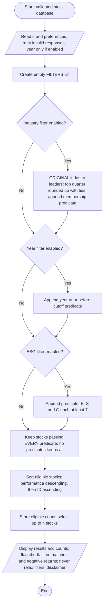

**Vrije Universiteit Amsterdam**  
**Computational Thinking**

# Project Assignment: iTrade

**Group number:** [Enter group number]

**Members with student numbers:**

- [Member 1] — [Student number 1]
- [Member 2] — [Student number 2]
- [Member 3] — [Student number 3]
- [Member 4] — [Student number 4]
- [Member 5] — [Student number 5]

**Task distribution:** [Record the actual research, algorithm design, implementation, testing and report contributions. Remove unused member rows.]

**Date:** 5 October 2026  
**Version:** Code-aligned draft

**Draft status:** Checked against `app/main.py` and the supplied 500-stock dataset. Names, student numbers, actual group contributions and personal experience must be confirmed by the authors before submission. Verification instructions and a snapshot of the complete Python application are included as appendices.

**Assistance acknowledgement:** An AI coding assistant helped revise the program and report, check references, run tests and generate the document exports. The submitting authors must review the work and adapt this acknowledgement to the course policy.

**Submission requirements:** `assignment.md` calls for an MS Word report using the Canvas template. Confirm the filename, current template and rubric in Canvas; the original template and a separate rubric are not included in this repository.

<!-- pagebreak -->

## Context Task

Modern computing has made financial participation faster and more accessible, but accessibility should not be confused with informed decision-making. Kirilenko and Lo (2013) identify lower transaction costs and faster execution as benefits of algorithmic trading, while also examining threats to financial stability. In my view, these benefits justify continued innovation only when accountability develops alongside technical capability. A system that executes efficiently can still expose inexperienced users to risks they do not understand.

Automated recommendations illustrate this tension. Ranking investments reduces the effort required to compare alternatives, yet a precise numerical ordering can imply more certainty than the evidence warrants. A historical-return ranking, such as iTrade's, describes observations rather than guaranteeing future gains. I therefore consider transparent assumptions, explicit limitations, and user control essential design responsibilities, rather than optional interface features.

Social responsibility also cannot be reduced to an apparently objective score. Berg, Kölbel, and Rigobon (2022) document substantial disagreement among ESG rating providers, arising from differences in measurement, scope, and weighting. Consequently, an ESG filter should communicate its chosen threshold and acknowledge uncertainty instead of presenting selected companies as unambiguously ethical.

The consequences of financial computing also extend beyond platform users. Howson and de Vries (2022) argue that proof-of-work cryptocurrency production can disproportionately burden vulnerable communities through environmental and social impacts. Their analysis challenges the assumption that digital finance is socially beneficial merely because it offers new participation opportunities.

Overall, I support financial technologies that improve access while making uncertainty visible. Appropriate safeguards include understandable explanations, auditable selection rules, and regulation sensitive to costs imposed on non-users. Technical convenience is valuable, but it should not substitute for financial literacy or public accountability.

<!-- pagebreak -->

## Design process

### Requirements and scope

The supplied `app/stocks.csv` contains 500 stocks and is used for the examples and verification in this report. Requirements are checked against `assignment.md`; the actual behaviour is determined by `app/main.py`. The dataset does not establish a return observation period or real-market provenance, so its values are treated as educational input rather than verified market observations.

The system recommends up to a user-specified number n, where `1 <= n <= 100`. It ranks stocks by the supplied performance percentage after applying any combination of three optional filters: industry leadership, establishment year and ESG criteria. All eight combinations of enabled/disabled filters are supported.

Each stock has a unique three-letter ID, performance, industry, foundation year and three ESG ratings from 1 to 10. Performance is interpreted as percentage points: `11.7` and `11.7%` both mean an 11.7% historical return, not a fractional value of 0.117. The algorithm assumes that performances use a comparable measurement period across all stocks; this is necessary for a meaningful ranking but cannot be verified from the supplied schema.

This is a screening tool, not a trading agent. It does not purchase stocks, allocate money, fetch live prices, predict returns or construct a diversified portfolio.

### Turning ambiguous preferences into explicit rules

**Industry leadership:** For an industry containing m stocks in the original database, calculate `k = ceil(m / 4)`. Sort that industry's performance values in descending order and take the k-th value as its cutoff. Every stock whose performance is at least this cutoff qualifies. Thus, the filter selects the top 25%, rounded up, with all ties at the boundary included. A one-company industry always has one qualifying company. A five-company industry uses its second-highest performance as the cutoff.

A fixed proportion is easier to explain than an industry-average rule and is less sensitive to a single exceptionally high return. Rounding up avoids excluding every company in a small industry. Including boundary ties avoids arbitrary exclusion of equal performers. More than 25% can qualify when values tie, and an industry in which every return is equal retains every stock. This is intentional.

**Original-database baseline:** Compute industry cutoffs before applying establishment or ESG filters. Otherwise, removing an industry's strongest companies could promote a relatively weak company into the leading group. The original-data approach makes industry eligibility stable regardless of the other preferences. Industry labels are grouped case-insensitively. CSV parsing trims surrounding whitespace and collapses repeated spaces; non-printable characters within a label are rejected. Spelling differences are not inferred to be equivalent.

**Establishment year:** When enabled, ask for an integer cutoff between 1800 and 2020, inclusive, and keep stocks with `foundation_year <= cutoff`. This includes companies established in the selected year. The limit applies to user input, not the dataset: a company founded before 1800 can still qualify. Age is only a proxy for establishment, not evidence of safety or quality.

**ESG:** Require `environment >= 7 AND social >= 7 AND governance >= 7`. Requiring a minimum in each category prevents an excellent environmental rating from concealing a poor governance rating. The threshold is a transparent project design choice, not a scientifically established definition of responsible business. Ratings may be decimal values within the allowed 1–10 range. No category receives a special weight.

The interface exposes the three required preferences but keeps the industry fraction and ESG threshold fixed. This reduces novice users' configuration burden and keeps the algorithm reproducible.

### Combining preferences, ranking and handling shortages

Enabled filters are combined with **AND**. A disabled filter imposes no restriction. Eligible stocks are sorted by their original, unrounded performance in descending order. Equal returns are ordered alphabetically by the normalised stock ID, producing repeatable results. Decimal arithmetic avoids introducing binary floating-point differences when reading CSV values. Printed returns use two decimal places; display rounding never determines the ranking.

Select the first `min(n, eligible_count)` stocks. Boundary ties in the industry filter do not expand the requested final list: the ID tiebreaker resolves any tie at the final n-th position.

If fewer than n stocks qualify, show all qualifying stocks, report requested/eligible/shown counts, and explicitly state that no filters were relaxed. If none qualify, show a no-matches message and invite the user to change their preferences and run again. Automatically weakening ESG or establishment preferences would contradict the user's stated requirements.

Negative-return stocks remain eligible. The assignment asks for the highest returns, not exclusively positive returns; the strongest company in a poorly performing industry may still have a negative return. The program adds a caution if any displayed stock has a negative return. There is no industry quota in the final list, so industry leadership must not be mistaken for diversification.

### Inputs, validation and implementation structure

The program always asks for preferences interactively through `get_preferences()`. It asks for n and each yes/no preference, and requests a year only when the establishment preference is enabled. Invalid responses are explained and re-prompted. There are no command-line options or separate noninteractive mode. End-of-input or Ctrl+C cancels cleanly.

The CSV reader recognises the supplied headers (`ID`, `Performance`, `Industry`, `FoundationYear`, `Environment`, `Social`, `Governance`), the assignment's longer property names, and common equivalents such as `Ticker`, `Return`, `Sector`, `Founded`, `E`, `S` and `G`. It supports UTF-8 with an optional byte-order mark, and comma, semicolon or tab delimiters. Performance numbers must use a decimal point rather than a locale-specific decimal comma.

The entire dataset is validated before screening. Missing columns, duplicate or ambiguous headers, duplicate IDs, malformed row lengths, invalid years, missing industries, non-finite performance and out-of-range ESG values cause an error rather than silently removing companies. IDs are normalised to uppercase and must consist of three ASCII letters. Dataset foundation years must be integers from 1 to 9999. Additional columns are ignored. Blank lines are permitted.

The expected assignment dataset has 500 stocks. Rather than refusing smaller teaching/test datasets, the program accepts any nonempty valid dataset and displays a notice when its size differs from 500. Missing files cause an explicit error; the application never substitutes invented data.

`app/main.py` contains only the iTrade application: input handling, validation, filtering, ranking and presentation. It uses only the Python standard library. The supplied dataset is stored beside it in `app/stocks.csv`; this default path is resolved relative to the script rather than the caller's working directory. The current repository does not contain a separate test suite or report-generation script. The app has no PDF, Word or LaTeX functionality or dependencies.

### Readable pipeline and function-based strategies

The application follows four explicit steps: `parse_csv()` parses and validates the loaded CSV text, `get_preferences()` collects settings, `recommend()` selects stocks, and `format_results()` formats the result for printing. `Stock`, `Preferences` and `Recommendation` are frozen dataclasses. Freezing prevents reassigning their fields; it does not make the list inside a `Recommendation` immutable. Formatting receives an existing result instead of repeating the selection process.

Each active preference becomes a function of type `StockFilter = Callable[[Stock], bool]`. `build_filters(stocks, preferences)` returns only the enabled predicates. If the industry preference is enabled, it first calls `get_industry_leaders(stocks)` on the complete input. Local functions retain that leader set or the chosen year cutoff; the ESG predicate checks all three ratings against 7.

`apply_filters(stocks, filters)` constructs a new list using `all(filter_fn(stock) for filter_fn in filters)`. A stock remains only if every active predicate passes. Evaluation stops at the first false result. With no active predicates, `all()` is true and every stock remains eligible. This requires no filter classes or builder object.

`recommend()` builds the filters, applies them, sorts the eligible list with `ranking_order()`, and returns its first n entries alongside the full eligible count. The shared key is `(-stock.performance, stock.id)` and is also used when sorting industry groups. Filtering and sorting produce new lists rather than mutating the supplied stock list. Three independent conditions construct the active filter list, avoiding separate branches for all eight combinations.

### Correctness and efficiency

Every returned stock comes from the eligible set, so it satisfies every enabled preference. The sorting key guarantees that no lower-return eligible stock precedes a higher-return one. Taking a prefix preserves that order and limits the list to n. As industry membership is calculated once on the full dataset, the order in which the remaining filter checks are evaluated does not change the outcome.

For N stocks, industry sorting and final ranking require at most **O(N log N)** time. Grouping and filtering are linear. Auxiliary storage is **O(N)**. This is comfortably sufficient for 500 records, and a straightforward sorting solution is easier to inspect than a more specialised optimisation.

### Alternatives, limitations and possible improvements

Alternative designs include keeping only each industry's single strongest company, using above-average returns, or using a weighted ESG average. The first is overly restrictive, the second is sensitive to extreme returns, and the third allows compensation between ESG dimensions. The selected rules prioritise transparency over personalisation.

A production system would need verified data provenance and timestamps, comparable return periods, a treatment of volatility and liquidity, transaction costs and controls against misleading recommendations. It should also explain uncertainty in ESG measurements, consistent with Berg et al. (2022). These improvements are outside the supplied schema. Neither passing an ESG threshold nor appearing near the top of the output establishes suitability for a particular investor.

### Challenges and solutions

Three concrete consistency issues were found during the report review: the prose named a removed filter helper, the Word appendix contained an older implementation, and the running instructions referred to deleted tests and export scripts. The report now describes `apply_filters()`, includes the current application verbatim, and provides a standalone verification command instead of presenting an unavailable suite as runnable evidence.

At the algorithm level, the main challenge is keeping industry membership stable while combining preferences. The solution separates leader calculation from filter execution: compute leaders once from the original stocks, then apply all selected predicates. A second challenge is explaining a result shorter than requested without contradicting the user's preferences; preserving the eligible count and printing a shortfall makes that outcome explicit.

The design uses decomposition (separate input, selection and formatting functions), abstraction (each active rule has the same true/false interface), and selection and iteration (choose enabled rules and test stocks). These describe the implementation, not a claim about which lessons the authors attended. Group-specific challenges and experiences still need to be added by the authors.

### Group work division and coordination

No group membership, contribution log or time record was supplied. Individual contributions therefore cannot honestly be attributed in this draft. Before submission, complete the following with the group's actual experience:

- **Members and responsibilities:** [Who researched sources, specified rules, implemented code, prepared the flowchart and edited the report?]
- **Time spent:** [Record an honest estimate for each member and the overall effort; no time log is available here.]
- **Integration and review:** [How did members compare the implementation, flowchart and pseudocode? Which tests did they review?]
- **Reflection on division:** [What worked, what was uneven or difficult, and what would the group change? If individual work, state that instead.]

The work can be divided into research, rule specification, implementation/testing and document integration. However, allocating these independently can create inconsistent definitions of industry leadership or ESG eligibility. A shared decision record and joint review of the same example output are therefore recommended. This is a proposed coordination strategy, not a claim about meetings or work that the group has already performed. AI assistance is disclosed on the cover and must be reviewed against course policy.

<!-- pagebreak -->

## Flowchart

The flowchart starts with a validated database; CSV parsing is a programming-specific prerequisite. Preference entry validates each response before advancing, rather than restarting all questions after an error. The filtering step keeps stocks passing every predicate and may stop checking a stock after its first failure.



The Word report contains a rendered version of this flowchart. Its editable Mermaid source is retained in `report.md`.

<!-- pagebreak -->

## Pseudocode

```text
INPUT: validated stock database S

READ n; explain and retry until it is an integer in [1, 100]
READ industry switch; retry until a valid yes/no response
READ establishment switch; retry until a valid yes/no response
IF establishment preference is enabled THEN
    READ year_cutoff; retry until it is an integer in [1800, 2020]
END IF
READ ESG switch; retry until a valid yes/no response

FILTERS <- empty list of predicates
IF industry preference is enabled THEN
    leaders <- empty set
    GROUP all stocks in ORIGINAL S by normalised industry
    FOR EACH industry group Q DO
        m <- number of stocks in Q
        k <- CEILING(m / 4)
        SORT Q by performance descending, then ID ascending
        cutoff <- performance of Q[k]  // positions start at 1
        FOR EACH stock s in Q DO
            IF s.performance >= cutoff THEN
                ADD s.ID to leaders
            END IF
        END FOR
    END FOR
    APPEND predicate "stock.ID is in leaders" to FILTERS
END IF
IF establishment preference is enabled THEN
    APPEND predicate "stock.year <= year_cutoff" to FILTERS
END IF
IF ESG preference is enabled THEN
    APPEND predicate "stock.E >= 7 AND stock.S >= 7 AND stock.G >= 7" to FILTERS
END IF

eligible <- empty list
FOR EACH stock s in S DO
    IF every predicate in FILTERS accepts s THEN
        APPEND s to eligible
    END IF
END FOR

SORT eligible by performance descending, then ID ascending
available <- LENGTH(eligible)
results <- FIRST MIN(n, available) elements of eligible

IF available < n THEN
    DISPLAY available, "stocks match; no filters were relaxed"
END IF
IF results is empty THEN
    DISPLAY "No matches; change preferences explicitly and run again"
ELSE
    DISPLAY numbered results: ID, return, industry, year, E, S, G
    IF any displayed return is negative THEN
        DISPLAY caution about negative historical returns
    END IF
END IF
DISPLAY data source, active filters, requested/eligible/shown counts
DISPLAY "Educational only; historical returns do not predict future gains"
END
```

With an empty FILTERS list, every stock passes. Disabled preferences create no predicates; the implementation represents a disabled year cutoff with `None`. Predicates are created before any stock is excluded, so industry leaders always refer to the original database. The display steps summarise the information shown, not its exact printed order.

<!-- pagebreak -->

## Reflection

The main design lesson is that a precise implementation begins with explicit decisions about ambiguous requirements. Defining “highest in the industry” required decisions about rounding, ties and the comparison population. The original-database baseline prevents an unintended change in eligibility when other preferences are enabled. Keeping the flowchart, pseudocode and implementation consistent also makes assumptions easier to inspect.

Testing boundary conditions is as important as checking a typical recommendation. In particular, zero matches, exact ESG thresholds and tied returns reveal whether the algorithm respects its stated rules. A useful improvement to the assignment would be to specify the return measurement period and provide examples of expected boundary behaviour while retaining freedom over the filtering strategy.

**Author completion required:** Add your genuine reaction to the assignment, actual time spent and personal learning experience. Check any reflection word limit against the Canvas template. These experiences cannot be inferred from the code or attributed to group members in this draft.

## Checklist for submission

- [ ] Complete names, student numbers, group details and actual contributions.
- [ ] Finalise the genuine personal reflection and check template-specific limits.
- [x] Context Task is 200–300 words with three cited academic references.
- [x] Flowchart, pseudocode and code specify the same filters, ties and shortfall policy.
- [x] Program tested with the supplied 500-stock dataset; actual results are in Appendix B.
- [x] Complete Python application included in Appendix C and `app/main.py`.
- [ ] Review assistance acknowledgement, course policy and the Canvas rubric.
- [ ] Check `report.docx` against the current Canvas Word template and required filename.
- [ ] Prepare and rehearse the separate presentation within the ten-minute limit in `assignment.md`.

<!-- pagebreak -->

## Appendix A. Files and running instructions

The project contains:

```text
app/
    main.py                 iTrade application; source of truth for behaviour
    stocks.csv              supplied dataset
assignment.md               assignment requirements
shell.nix                   Python 3.12 and uv development environment
report.md                   editable report, including a code snapshot
report.docx                 Word version of this report
```

The application requires Python 3.10 or newer and no third-party Python packages. From the project root, enter the Nix shell and run it through uv:

```bash
nix-shell
uv run --no-project python app/main.py
```

Alternatively, run directly with an existing Python installation:

```bash
python3 app/main.py
```

`shell.nix` provides Python 3.12 and uv. It sets `UV_PYTHON` to the Nix interpreter and disables uv-managed Python downloads. `--no-project` runs the script without a `pyproject.toml` or project dependencies. Nix must be installed and `<nixpkgs>` available in its search path. The shell uses that local nixpkgs revision, not a repository-pinned package snapshot; the first shell entry may download Nix packages.

The app always reads `stocks.csv` beside `main.py`, even when launched from a different directory. It asks how many stocks to show, whether to apply the industry filter, whether to apply the establishment filter (and its year if enabled), and whether to apply the ESG filter. Answer n to all three filter questions for an unfiltered ranking. The app prints recommendations and never creates report files.

`app/main.py` is the source of truth, not either report. Appendix C is a verbatim snapshot, not an automatically updated include. After changing the code, update that snapshot, the algorithm descriptions and examples, then refresh the Word document. The current Word report was generated from this Markdown with its flowchart rendered as an image; no report exporter or separate test suite is retained in the repository.

<!-- pagebreak -->

## Appendix B. Verification and actual example output

### Reproducible checks

The previous test suite was removed during repository cleanup. A historical test count is not evidence of a test suite available in this version. The following standalone check was run with Python 3.12 in the Nix shell. It compares all eight filter combinations and n values of 1, 10 and 100 against an independent rank-count definition, verifies that inputs are unchanged, and checks the two report examples. Run it from the project root after entering `nix-shell`:

```bash
uv run --no-project python - <<'PY'
from pathlib import Path
from app.main import Preferences, format_results, parse_csv, recommend

stocks = parse_csv(Path("app/stocks.csv").read_text(encoding="utf-8-sig"))
assert len(stocks) == len({s.id for s in stocks}) == 500
before = stocks[:]
leaders = set()
for stock in stocks:
    peers = [s for s in stocks if s.industry.casefold() == stock.industry.casefold()]
    places = (len(peers) + 3) // 4
    if sum(s.performance > stock.performance for s in peers) < places:
        leaders.add(stock.id)

counts = []
for industry in (False, True):
    for year in (None, 1950):
        for esg in (False, True):
            expected = [s for s in stocks
                        if (not industry or s.id in leaders)
                        and (year is None or s.year <= year)
                        and (not esg or min(s.environment, s.social, s.governance) >= 7)]
            expected.sort(key=lambda s: (-s.performance, s.id))
            counts.append(len(expected))
            for n in (1, 10, 100):
                result = recommend(stocks, Preferences(n, industry, year, esg))
                assert result.stocks == expected[:n]
                assert result.eligible_count == len(expected)
assert counts == [500, 35, 340, 21, 128, 7, 82, 5]
assert stocks == before

prefs = Preferences(10, True, 1950, True)
result = recommend(stocks, prefs)
assert [s.id for s in result.stocks] == ["FKV", "GWV", "FIE", "XYL", "GTQ"]
report = Path("report.md").read_text()
assert format_results(result, prefs, "stocks.csv", len(stocks)) in report
empty = recommend(stocks, Preferences(5, True, 1800, True))
assert empty.stocks == [] and empty.eligible_count == 0
print("24 ranking/count comparisons and report examples passed.")
PY
```

The independent leader rule counts how many industry peers have a strictly higher performance. A stock qualifies if that number is below `ceil(m/4)`. It includes ties without reusing the implementation's sorted-cutoff calculation.

These checks establish consistency for the supplied data and examples, not exhaustive validation of every possible CSV or interaction. Important boundary cases for future regression tests include tied cutoffs, singleton industries, negative returns, exact ESG and year boundaries, invalid inputs and cancellation. Screening correctness does not demonstrate future investment performance.

### Dataset and filter coverage

The supplied dataset has 500 unique IDs across seven industries: agriculture (85), clothing (65), construction (75), electronics (71), energy (74), entertainment (67) and mining (63). All rows pass validation. Eligible counts before limiting results to n are:

| Industry filter | Founded by 1950 | ESG filter | Eligible |
|---|---|---|---:|
| Off | Off | Off | 500 |
| Off | Off | On | 35 |
| Off | On | Off | 340 |
| Off | On | On | 21 |
| On | Off | Off | 128 |
| On | Off | On | 7 |
| On | On | Off | 82 |
| On | On | On | 5 |

Enabling additional filters cannot increase the eligible set. The industry-only count is 128 rather than exactly 125 because the top-quarter count is rounded up separately for each industry.

<!-- pagebreak -->

### Combined filters and a transparent shortfall

Run `python3 app/main.py` and answer the prompts:

```text
How many stocks (1–100)? 10
Only the top 25% in each industry (including ties)? [y/n]: y
Filter by establishment year? [y/n]: y
Founded by year (1800–2020)? 1950
Require each ESG score to be at least 7/10? [y/n]: y
```

Actual results from the supplied dataset:

```text
iTrade | STOCK SCREEN
============================================================================
Data: stocks.csv
Loaded: 500 stocks
Filters: industry top 25% (rounded up, boundary ties included); founded <= 1950; E, S and G each >= 7
Requested: 10 | Eligible: 5 | Showing: 5
SHORTFALL: only 5 match. No filters were relaxed.

Rank  ID    Return  Industry     Founded   E   S   G
-------------------------------------------------------------
   1  FKV    45.64%  energy          1926   7   8   9
   2  GWV    43.14%  agriculture     1806   7   7   8
   3  FIE    42.90%  electronics     1917   8  10   7
   4  XYL    32.16%  energy          1936   8  10   8
   5  GTQ    23.62%  mining          1911  10   8   9

Educational screening only; not financial advice. Historical returns do not predict future returns. Rankings do not measure risk or diversification.
```

All five results meet the age and ESG thresholds, and their returns decrease down the list. Two energy stocks remain: the industry filter does not impose one-stock-per-industry diversification. The request for ten is not fulfilled by inserting companies that fail a preference.

### Zero qualifying stocks

With the same filters, requesting 5 stocks and entering 1800 as the year cutoff produces:

```text
Requested: 5 | Eligible: 0 | Showing: 0
SHORTFALL: only 0 match. No filters were relaxed.
No matches. Change your preferences explicitly and run again.
```

This demonstrates the zero-result path without a crash, invented recommendation or silent relaxation.

<!-- pagebreak -->

## References

Berg, F., Kölbel, J. F., & Rigobon, R. (2022). Aggregate confusion: The divergence of ESG ratings. *Review of Finance, 26*(6), 1315–1344. [https://doi.org/10.1093/rof/rfac033](https://doi.org/10.1093/rof/rfac033).

Howson, P., & de Vries, A. (2022). Preying on the poor? Opportunities and challenges for tackling the social and environmental threats of cryptocurrencies for vulnerable and low-income communities. *Energy Research & Social Science, 84*, 102394. [https://doi.org/10.1016/j.erss.2021.102394](https://doi.org/10.1016/j.erss.2021.102394).

Kirilenko, A. A., & Lo, A. W. (2013). Moore's Law versus Murphy's Law: Algorithmic trading and its discontents. *Journal of Economic Perspectives, 27*(2), 51–72. [https://doi.org/10.1257/jep.27.2.51](https://doi.org/10.1257/jep.27.2.51).

The Context Task uses findings described in these publications' abstracts and the Review of Finance's author summary of Berg et al. It does not claim an independent replication of their research. These sources support the benefits/risks, ESG uncertainty and distributional-impact claims respectively; the proposed safeguards are the report's normative argument.

<!-- pagebreak -->

## Appendix C. Complete Python application

The following listing is a verbatim snapshot of `app/main.py` at this revision. The runnable source and stock dataset are provided in `app/`. If they differ from this appendix after a later edit, the application source takes precedence and the report must be refreshed.

```python
#!/usr/bin/env python3
"""iTrade: an educational stock screener using the supplied stocks.csv.

Run: python3 app/main.py
The app asks for all preferences interactively. There are no command-line options.
Requires Python 3.10+ and only the standard library.
"""
from __future__ import annotations

import csv
from collections.abc import Callable
from dataclasses import dataclass
from decimal import Decimal, InvalidOperation
from io import StringIO
from math import ceil
from pathlib import Path
import re
import sys


DISCLAIMER = (
    "Educational screening only; not financial advice. Historical returns do not "
    "predict future returns. Rankings do not measure risk or diversification."
)


@dataclass(frozen=True)
class Stock:
    id: str
    performance: Decimal
    industry: str
    year: int
    environment: Decimal
    social: Decimal
    governance: Decimal


@dataclass(frozen=True)
class Preferences:
    n: int
    industry_best: bool = False
    founded_by: int | None = None
    esg: bool = False

    def __post_init__(self):
        if type(self.n) is not int or not 1 <= self.n <= 100:
            raise ValueError("Number of stocks must be an integer from 1 to 100.")

        # None means that the user has not enabled the year filter.
        if self.founded_by is not None:
            if type(self.founded_by) is not int or not 1800 <= self.founded_by <= 2020:
                raise ValueError("Establishment cutoff must be an integer from 1800 to 2020.")


@dataclass(frozen=True)
class Recommendation:
    stocks: list[Stock]
    eligible_count: int


def parse_csv(text: str) -> list[Stock]:
    """Validate the whole dataset before recommending; never silently drop rows."""
    fields = {
        "id": {"id", "stockid", "companyid", "ticker", "symbol"},
        "performance": {"performance", "return", "returns", "performancepercent"},
        "industry": {"industry", "sector"},
        "year": {"foundationyear", "establishmentyear", "founded", "year", "yearfounded"},
        "environment": {"environmentalrating", "environmentrating", "environment", "environmental", "e"},
        "social": {"socialrating", "social", "s"},
        "governance": {"governancerating", "governance", "g"},
    }

    def number(value: str, label: str, percent: bool = False) -> Decimal:
        text = value.strip()
        if percent and text.endswith("%"):
            text = text[:-1].strip()
        try:
            result = Decimal(text)
        except InvalidOperation:
            raise ValueError(f"{label} must be a number, got {value!r}.") from None
        if not result.is_finite():
            raise ValueError(f"{label} must be finite.")
        return result

    try:
        dialect = csv.Sniffer().sniff(text[:8192], delimiters=",;\t")
    except csv.Error:
        dialect = csv.excel
    reader = csv.DictReader(StringIO(text), dialect=dialect, strict=True)
    if not reader.fieldnames:
        raise ValueError("CSV is empty or has no header.")
    columns = {}
    seen_headers = set()
    for header in reader.fieldnames:
        key = re.sub(r"[^a-z0-9]", "", header.lower().lstrip("\ufeff"))
        if key in seen_headers:
            raise ValueError(f"Duplicate CSV header: {header!r}.")
        seen_headers.add(key)
        for field, aliases in fields.items():
            if key in aliases:
                if field in columns:
                    raise ValueError(f"More than one column maps to {field}.")
                columns[field] = header
    for field in fields:
        if field not in columns:
            raise ValueError(f"Missing CSV column: {field}.")

    stocks = []
    ids = set()
    for row in reader:
        try:
            if None in row or any(value is None for value in row.values()):
                raise ValueError("Row has the wrong number of columns.")
            data = {key: row[column].strip() for key, column in columns.items()}
            ident = data["id"].upper()
            if not re.fullmatch(r"[A-Z]{3}", ident):
                raise ValueError("ID must contain exactly three ASCII letters.")
            if ident in ids:
                raise ValueError(f"Duplicate stock ID: {ident}.")
            if not data["industry"] or not data["industry"].isprintable():
                raise ValueError("Industry must be nonempty, printable text.")
            # The user cutoff is limited to 1800–2020, not the dataset's years.
            if not re.fullmatch(r"[0-9]{1,4}", data["year"]):
                raise ValueError("Foundation year must be an integer from 1 to 9999.")
            year = int(data["year"])
            if year < 1:
                raise ValueError("Foundation year must be from 1 to 9999.")
            environment = number(data["environment"], "Environment")
            social = number(data["social"], "Social")
            governance = number(data["governance"], "Governance")
            for rating in (environment, social, governance):
                if not 1 <= rating <= 10:
                    raise ValueError("Every ESG rating must be between 1 and 10.")

            stock = Stock(
                id=ident,
                performance=number(data["performance"], "Performance", percent=True),
                industry=" ".join(data["industry"].split()),
                year=year,
                environment=environment,
                social=social,
                governance=governance,
            )
            stocks.append(stock)
            ids.add(ident)
        except ValueError as exc:
            raise ValueError(f"CSV line {reader.line_num}: {exc}") from None
    if not stocks:
        raise ValueError("CSV contains no stocks.")
    return stocks


StockFilter = Callable[[Stock], bool]


def ranking_order(stock: Stock) -> tuple[Decimal, str]:
    """Rank by descending performance, then ascending ID for ties."""
    return (-stock.performance, stock.id)


def get_industry_leaders(stocks: list[Stock]) -> set[str]:
    """Find the top quarter (including cutoff ties) in each original industry."""
    groups: dict[str, list[Stock]] = {}
    for stock in stocks:
        groups.setdefault(stock.industry.casefold(), []).append(stock)

    leaders: set[str] = set()
    for group in groups.values():
        ranked = sorted(group, key=ranking_order)
        places = ceil(len(group) / 4)
        cutoff = ranked[places - 1].performance
        leaders.update(stock.id for stock in group if stock.performance >= cutoff)
    return leaders


def build_filters(stocks: list[Stock], preferences: Preferences) -> list[StockFilter]:
    """Turn enabled preferences into predicates using the untouched dataset."""
    filters: list[StockFilter] = []
    if preferences.industry_best:
        # Calculate leaders before applying any year or ESG criteria.
        leaders = get_industry_leaders(stocks)

        def industry_filter(stock: Stock) -> bool:
            return stock.id in leaders

        filters.append(industry_filter)

    if preferences.founded_by is not None:
        cutoff_year = preferences.founded_by

        def year_filter(stock: Stock) -> bool:
            return stock.year <= cutoff_year

        filters.append(year_filter)

    if preferences.esg:
        def esg_filter(stock: Stock) -> bool:
            return (
                stock.environment >= Decimal("7")
                and stock.social >= Decimal("7")
                and stock.governance >= Decimal("7")
            )

        filters.append(esg_filter)

    return filters


def apply_filters(stocks: list[Stock], filters: list[StockFilter]) -> list[Stock]:
    """Keep stocks passing every predicate; an empty filter list keeps all."""
    return [stock for stock in stocks if all(filter_fn(stock) for filter_fn in filters)]


def recommend(stocks: list[Stock], preferences: Preferences) -> Recommendation:
    """Apply all enabled criteria, rank matches, and select up to n stocks."""
    filters = build_filters(stocks, preferences)
    eligible = apply_filters(stocks, filters)
    ranked = sorted(eligible, key=ranking_order)
    return Recommendation(stocks=ranked[:preferences.n], eligible_count=len(eligible))


def format_results(result: Recommendation, prefs: Preferences, source: str, stock_count: int) -> str:
    """Format an existing result; do not run the recommendation again."""
    selected = result.stocks
    total = result.eligible_count
    active = []
    if prefs.industry_best:
        active.append("industry top 25% (rounded up, boundary ties included)")
    if prefs.founded_by is not None:
        active.append(f"founded <= {prefs.founded_by}")
    if prefs.esg:
        active.append("E, S and G each >= 7")
    lines = ["iTrade | STOCK SCREEN", "=" * 76, f"Data: {source}",
             f"Loaded: {stock_count} stocks", "Filters: " + ("; ".join(active) or "none"),
             f"Requested: {prefs.n} | Eligible: {total} | Showing: {len(selected)}"]
    if stock_count != 500:
        lines.append("NOTE: Assignment expects 500 stocks; using all supplied records.")
    if total < prefs.n:
        lines.append(f"SHORTFALL: only {total} match. No filters were relaxed.")
    if not selected:
        lines.append("No matches. Change your preferences explicitly and run again.")
    else:
        width = 8
        for stock in selected:
            width = max(width, len(stock.industry))
        width = min(width, 22)
        lines += ["", f"Rank  ID    Return  {'Industry':<{width}}  Founded   E   S   G",
                  "-" * (50 + width)]
        for rank, stock in enumerate(selected, 1):
            industry = stock.industry
            if len(industry) > width:
                industry = industry[:width - 3] + "..."
            lines.append(f"{rank:>4}  {stock.id}  {stock.performance:>7.2f}%  "
                         f"{industry:<{width}}  {stock.year:>7}  "
                         f"{stock.environment:>2g}  {stock.social:>2g}  {stock.governance:>2g}")
        for stock in selected:
            if stock.performance < 0:
                lines.append("CAUTION: Some selected stocks have negative historical returns.")
                break
    return "\n".join(lines + ["", DISCLAIMER])


def get_preferences() -> Preferences:
    def ask_int(prompt: str, low: int, high: int) -> int:
        while True:
            try:
                value = int(input(prompt).strip())
                if low <= value <= high:
                    return value
            except ValueError:
                pass
            print(f"Enter a whole number from {low} to {high}.")

    def ask_yes(prompt: str) -> bool:
        while True:
            answer = input(prompt + " [y/n]: ").strip().lower()
            if answer in {"y", "yes", "n", "no"}:
                return answer in {"y", "yes"}
            print("Please enter y or n.")

    print("\niTrade preferences (all enabled filters must be satisfied)")
    n = ask_int("How many stocks (1–100)? ", 1, 100)
    industry = ask_yes("Only the top 25% in each industry (including ties)?")
    year = None
    if ask_yes("Filter by establishment year?"):
        year = ask_int("Founded by year (1800–2020)? ", 1800, 2020)
    esg = ask_yes("Require each ESG score to be at least 7/10?")
    return Preferences(n=n, industry_best=industry, founded_by=year, esg=esg)


def main() -> int:
    path = Path(__file__).resolve().with_name("stocks.csv")

    try:
        # The application pipeline: load, choose preferences, recommend, print.
        stocks = parse_csv(path.read_text(encoding="utf-8-sig"))
        preferences = get_preferences()
        result = recommend(stocks, preferences)
        print(format_results(result, preferences, path.name, len(stocks)))
        return 0
    except FileNotFoundError:
        print("Error: stocks.csv must be in the same folder as main.py.", file=sys.stderr)
    except (ValueError, OSError, UnicodeError, csv.Error) as exc:
        print(f"Error: {exc}", file=sys.stderr)
    except (EOFError, KeyboardInterrupt):
        print("\nCancelled. No recommendation was completed.", file=sys.stderr)
        return 130
    return 1


if __name__ == "__main__":
    sys.exit(main())
```
